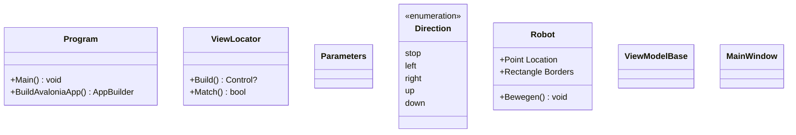

```mermaid
classDiagram

class Program {
  +Main() void
  +BuildAvaloniaApp() AppBuilder
}

class ViewLocator {
  +Build() Control?
  +Match() bool
}

class Parameters {

}

class Direction {
  <<enumeration>>
  stop
  left
  right
  up
  down
}

class Robot {
  +Point Location
  +Rectangle Borders
  +Bewegen() void
}

class ViewModelBase {

}

class MainWindow {

}

```
